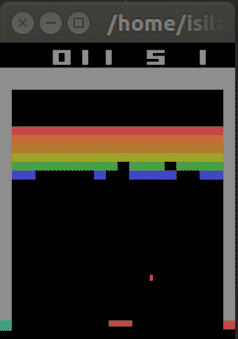
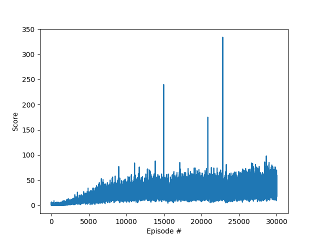

## Implementation
- q_model.py:build the same CNN architecture as in the original Nature paper
- dqn_agent.py:implentation of replay buffer and target network techniques
- Deep_Q_Network.py:train the Atari game Breakout 

## Results

Result of training for 30 hours using GTX TITAN.

  
  <i>30 thousand iterations</i>

