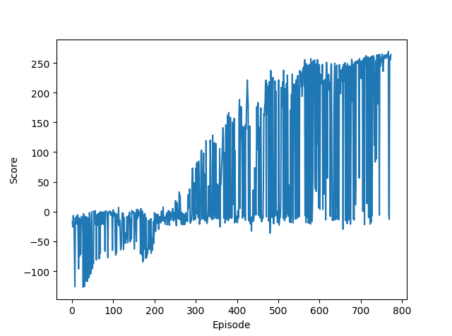
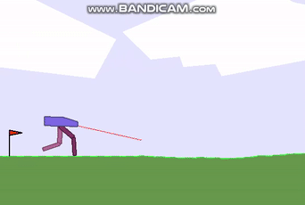

# Proximal Policy Optimization
## Code explanation 
- **ac_model.py:** build separated Actor-Critic architecture
- **ppo.py:** trained on the toy example Pendulum, set LOAD_MODEL as True to watch the intelligent agent
- **ppo_bipedalwalker.py:** trained on BipedalWalker-v2  
- **load the tensorboard:** tensorboard --log_dir = runs

## Results
### rewards figure
<table>
    <tr>
        <td >
Fig.1 pendulum rewards
</td>
        <td >
Fig.2 PG with baseline
</td>
    </tr>
</table>

### intelligent agent
Test rewards of Pendulum agent in ten episodes:
> Average rewards:-230.52313164492534   Average steps:200.0 

  

Test rewards of BipedalWalker agent in ten episodes:
> Average rewards: 239.6173305411697    Average steps: 1181.4

  