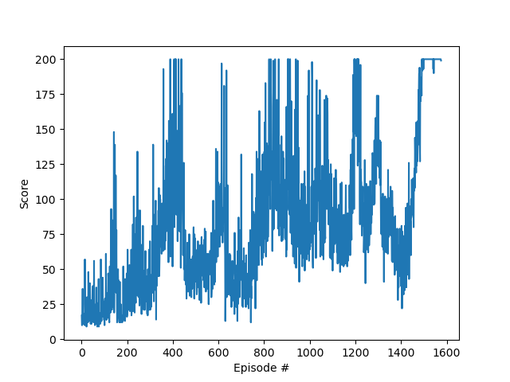

# Vanilla Policy Gradient
## Code explanation 
- **pg_agent.py:** build a one-hidden layer policy net, randomly generate tensors to test the model architecture
- **policy_gradient.py:** trained on the toy example Cartpole.  
  1. Vannilla_PG() function is an implementation of vannilla policy gradient algorithm.
  2. PG_with_constraints() function is an implementation with _baseline_ and _entropy loss_. 
  3. watch_agent() function is used to watch the intelligent agent to play. 
  4. Trained parameters were saved in model/pg_checkpoint.pth.

## Results
### rewards figure
<figure class="third">
    
    
    
</figure>
<!--

 -->

### intelligent agent
Test rewards of intelligent agent in ten episodes:
> Test rewards are: 200.0 200.0 200.0 200.0 200.0 200.0 200.0 200.0 200.0 200.0  

